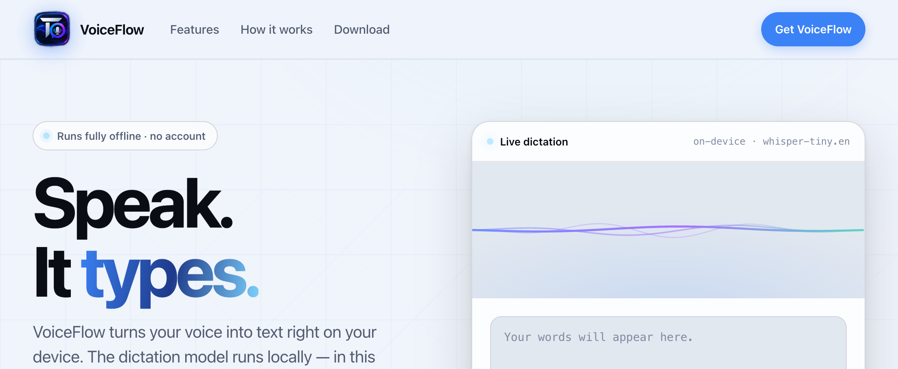
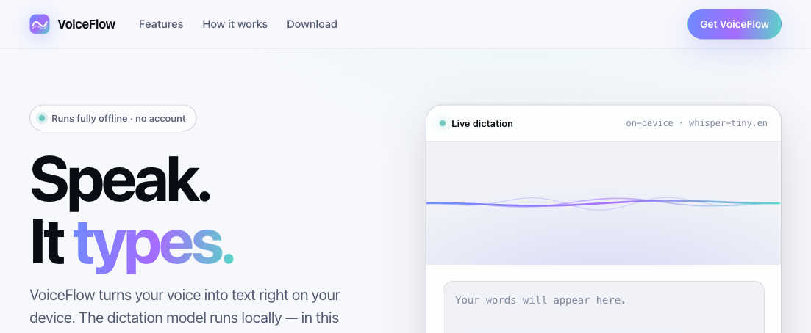
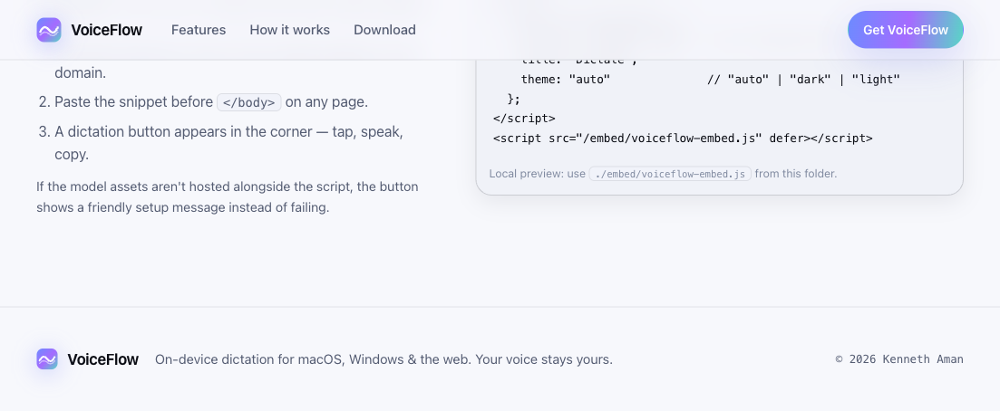

# VoiceFlow

On-device speech-to-text. Nothing leaves your machine.

VoiceFlow turns your voice into text using a local Whisper model — fully offline, no cloud, no API key required. Available as a cross-platform desktop app (Tauri + Rust) for **macOS, Windows, and Linux**, a native macOS app (Swift 6 · XcodeGen), and a browser-based demo (WebAssembly).





## Implementations

| Platform | Stack | Location |
|----------|-------|----------|
| **macOS native** | Swift 6 · whisper.cpp · XcodeGen | `VoiceFlow/` |
| **Cross-platform desktop** | Tauri v2 · Rust · whisper-rs | `tauri-app/` |
| **Browser demo** | HTML · Transformers.js · ONNX WASM | `Website/` |

## Features

- **Offline dictation** — speech recognition runs entirely on-device via local Whisper
- **Global shortcut** — ⌘⇧V (macOS) / Ctrl+Shift+V (Windows/Linux) to toggle recording from anywhere
- **System tray / menu-bar app** — runs in the background, shows window on demand; Dock-less on macOS (`LSUIElement`)
- **Auto-copy to clipboard** — optionally paste the transcript into the frontmost app
- **Streaming transcription** — real-time partial transcripts via Groq API (optional, free tier)
- **Smart editing** — filler-word removal and auto-formatting (um, uh, like, etc.)
- **Mini widget** — floating mic icon for quick one-tap recording
- **Dark premium UI** — cyan/indigo accent with recording glow animations
- **Embedded dictation** — add a floating dictation widget to any website

## Quick Start

### Prerequisites

- [Node.js](https://nodejs.org/) 18+
- [Rust](https://rustup.rs/) (latest stable)

### macOS

```bash
brew install pkg-config cmake
xcode-select --install
```

### Windows

```powershell
winget install Rustlang.Rustup
# Install Visual Studio Build Tools with "Desktop development with C++"
# https://visualstudio.microsoft.com/visual-cpp-build-tools/
```

### Linux (Ubuntu/Debian)

```bash
sudo apt update
sudo apt install -y libwebkit2gtk-4.1-dev libappindicator3-dev librsvg2-dev \
  patchelf libssl-dev libasound2-dev pkg-config cmake
```

### One-Time Setup (all platforms)

```bash
./scripts/setup.sh        # macOS / Linux
.\scripts\setup.ps1       # Windows (PowerShell)
```

Or do it manually:

```bash
cd tauri-app
npm install
mkdir -p src-tauri/models
curl -L -o src-tauri/models/ggml-base.bin \
  https://huggingface.co/ggerganov/whisper.cpp/resolve/main/ggml-base.bin
```

### Build & Run

```bash
cd tauri-app

# Development
npm run tauri dev

# Production — outputs .app/.dmg (macOS), .msi/.exe (Windows), .deb/.AppImage (Linux)
npm run tauri build
```

### Swift macOS App (native)

```bash
# Generate Xcode project from VoiceFlow.yml
brew install xcodegen
xcodegen generate

# Open and build in Xcode
open VoiceFlow.xcodeproj
```

The Swift app uses [whisper.cpp](https://github.com/ggerganov/whisper.cpp) v1.7.4 via SPM and requires `brew install whisper-cpp`.

## Streaming Mode (Groq API — Free)

VoiceFlow includes optional streaming transcription via [Groq's free Whisper API](https://groq.com):

1. Get a free API key at [console.groq.com](https://console.groq.com) (no credit card)
2. Copy `.env.example` to `.env` and add your key:
   ```
   GROQ_API_KEY=gsk_your_key_here
   ```
3. Running `npm run tauri dev` auto-loads `GROQ_API_KEY` from the root `.env`. You can also set it via **Settings → Groq API key** in the app — this is saved to `config.json` in your OS app-config directory and persists across restarts.
4. The key must be set before clicking **"Stream (Groq)"** in the app or using the tray menu.

### What it does
- Real-time transcription with ~275ms latency via the [Groq Whisper API](https://groq.com)
- Smart editing: removes filler words, fixes punctuation, auto-capitalizes

## Browser Demo

The Website folder contains a pure offline dictation page that runs Whisper tiny.en entirely in the browser via WebAssembly — no backend, no API key.

```bash
cd Website
./setup-offline-stt.sh      # one-time: downloads ~40MB of runtime + model
python3 -m http.server 8080 # serve the page
# open http://localhost:8080
```

Microphone access requires HTTP(S); it won't work on `file://`.

### Embed on Your Own Site

Host the Website folder on your domain and add:

```html
<script>
  window.VOICEFLOW_CONFIG = { position: "bottom-right", title: "Dictate", theme: "auto" };
</script>
<script src="/embed/voiceflow-embed.js" defer></script>
```

A floating dictation button appears. It uses the same on-device pipeline and shows a friendly setup message if the model assets aren't hosted alongside it. See **[Website/OFFLINE-STT.md](Website/OFFLINE-STT.md)** for full architecture and privacy details.

## Architecture

```
Audio Input (16kHz PCM)
    ↓
[Whisper STT]  ← Local (whisper-rs / whisper.cpp) or Groq API
    ↓
Raw Transcript
    ↓
[Smart Editor]  ← Filler removal, auto-edits, punctuation
    ↓
Clean, formatted text → Clipboard / Display
```

## Docker — Full Backend Stack & Dev Environment

VoiceFlow ships with a complete Docker setup for **local LLM inference**, a **self-hosted Whisper API** (Groq alternative), and a **reproducible Tauri build environment**. No native Rust or WebKit installs required on the host.

### What's included

| Service | Image | Purpose |
|---------|-------|---------|
| `ollama` | `voiceflow/ollama` | Local LLM server (phi-3.5-mini) for smart editing, punctuation, filler removal |
| `whisper-api` | `voiceflow/whisper-api` | Self-hosted Whisper transcription endpoint (`POST /transcribe`) |
| `dev` | `voiceflow/dev` | Tauri build environment — Rust + Node + WebKit deps, all pre-installed |

### Quick start

```bash
# Start Ollama + Whisper API in the background
./scripts/docker-up.sh

# Check status
./scripts/docker-up.sh --status

# Open an interactive dev shell (build the Tauri app inside)
./scripts/docker-up.sh --shell

# Build the desktop app from inside the container
./scripts/build-tauri.sh
```

### Services

- **Ollama** → `http://localhost:11434` — runs `phi-3.5-mini:q4_K_M` by default (~4 GB RAM). Swap the model in `docker-compose.yml` build args for `llama3.2:1b` (1 GB) or `mistral:7b` (5 GB). GPU acceleration available via NVIDIA Container Toolkit.

- **Whisper API** → `http://localhost:8081` — drop-in replacement for Groq. Accepts audio files and returns transcribed text with timestamps. Model size controlled by `WHISPER_MODEL` env var (`tiny` | `base` | `small` | `medium` | `large-v3`).

- **Dev container** → No exposed ports. Use `docker compose exec dev bash` for an interactive shell, or `docker compose run --rm dev npm run tauri dev` to run the app.

### Architecture in Docker

```
┌─────────────────┐      ┌──────────────────┐      ┌─────────────────┐
│  Tauri App      │─────▶│  ollama:11434     │      │  whisper-api    │
│  (native or     │      │  phi-3.5-mini    │      │  :8081          │
│   in dev ctr)   │      │  (editing layer) │      │  (STT fallback) │
└─────────────────┘      └──────────────────┘      └─────────────────┘
       │                         ▲                          ▲
       │ audio                   │ raw transcript           │ audio file
       ▼                         │ (punctuated, edited)     │
┌─────────────────┐      ┌──────────────────┐      ┌─────────────────┐
│  Microphone     │      │  Named volumes   │      │  Named volume   │
│  (16 kHz PCM)   │      │  (models persist)│      │  (model cache)  │
└─────────────────┘      └──────────────────┘      └─────────────────┘
```

All models are persisted in named Docker volumes — rebuilding containers never re-downloads weights.

### GPU support (optional)

On machines with NVIDIA GPUs, uncomment the `deploy` block in `docker-compose.yml` under the `ollama` service and ensure the [NVIDIA Container Toolkit](https://docs.nvidia.com/datacenter/cloud-native/container-toolkit/install-guide.html) is installed. The Whisper API service also supports `WHISPER_DEVICE=cuda`.

### Docker Compose commands

```bash
# Start backend services only (Ollama + Whisper API)
docker compose up -d

# Full stack including dev shell
docker compose up -d ollama whisper-api dev

# Stop everything (keeps data volumes)
docker compose down

# Rebuild all images from scratch
docker compose build --pull

# View logs
docker compose logs -f ollama
docker compose logs -f whisper-api
```

## Privacy

Offline mode makes zero network requests. Streaming mode sends audio only to Groq's API (no storage). The Website demo enforces a strict CSP and sets `allowRemoteModels = false` to prevent any model fetch from a remote origin.

## Project Structure

```
VoiceFlow/
├── VoiceFlow/                 # macOS native app (Swift 6 · whisper.cpp)
│   ├── Sources/App/           # SwiftUI views (VoiceFlowApp, VoiceAgentView, etc.)
│   ├── Sources/Audio/         # AudioCaptureEngine (AVAudioRecorder)
│   ├── Sources/Core/          # AppState, AppSettings, DictationCoordinator, PermissionManager
│   ├── Sources/Speech/        # WhisperEngine, TextPostProcessor, ModelManager
│   └── Resources/             # Assets, xcassets
├── Website/                   # Browser demo (Transformers.js · ONNX WebAssembly)
│   ├── index.html + css/style.css
│   ├── js/voice-agent.js      # Offline dictation engine
│   ├── js/vendor/             # Transformers.js + ONNX WASM (populated by setup)
│   ├── models/whisper-tiny.en/  # Local Whisper model (populated by setup)
│   ├── embed/voiceflow-embed.js # Floating dictation widget
│   ├── setup-offline-stt.sh   # One-time setup script
│   └── OFFLINE-STT.md         # Architecture & privacy details
├── tauri-app/                 # Cross-platform desktop app (Tauri v2 · Rust)
│   ├── src/main.ts            # Frontend: recording, streaming, tray UI
│   └── src-tauri/src/         # Backend: audio.rs, whisper.rs, whisperflow.rs, editor.rs
│       ├── models/ggml-base.bin  # Whisper base model (~141MB)
│       └── tauri.conf.json    # App manifest
├── scripts/                     # Setup, Docker, and build helpers
│   ├── setup.sh & setup.ps1     # Cross-platform one-time setup
│   ├── docker-up.sh             # Docker quick-launch manager
│   └── build-tauri.sh           # Build Tauri app inside Docker container
├── docker/                      # Production Docker stack
│   ├── ollama/Dockerfile        # Local LLM server (phi-3.5-mini) for smart editing
│   ├── whisper-api/             # Self-hosted Whisper transcription API
│   │   ├── Dockerfile
│   │   └── app.py               # FastAPI + openai-whisper endpoint
│   └── dev/Dockerfile           # Tauri build env (Rust + Node + WebKit pre-installed)
├── docker-compose.yml           # Orchestrates ollama + whisper-api + dev
├── .dockerignore                # Excludes build artifacts from images
└── VoiceFlow.yml                # XcodeGen config
```

## License

This project is triple-licensed under your choice of:

| License | Key Points |
|---------|------------|
| [**MIT**](https://opensource.org/licenses/MIT) | Simple, permissive — use anywhere, no restrictions |
| [**Apache 2.0**](https://www.apache.org/licenses/LICENSE-2.0) | MIT + patent protection — contributors grant patent rights |
| [**GPL v3**](https://www.gnu.org/licenses/gpl-3.0.html) | Copyleft — derivative works must also be open source |

You may choose to use, distribute, and/or modify this software under any one (or more) of these licenses. See [LICENSE](LICENSE) for full text.

---

Kenneth Aman
